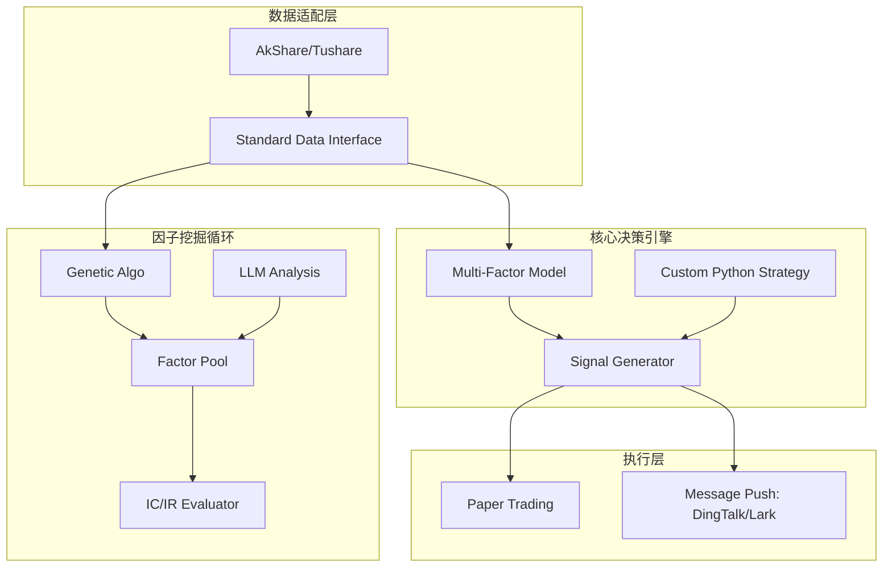

项目介绍

---

# OmniAlpha: 全场景智能量化研究与交易引擎

**OmniAlpha** 是一个专为 A 股市场设计的模块化量化交易平台。它不仅集成了实时行情获取、历史回测和模拟盘执行，更核心的突破在于其**双循环架构**：内置基于遗传算法与强化学习的 **AlphaGen 因子挖掘工厂**，并预留了 **LLM（大语言模型）** 接口，用于语义情感分析与策略自动化生成。

## 🌟 核心特性

* **🛠️ 模块化架构 (Modular Arch)**: 采用依赖倒置设计，支持 Data Provider、Strategy、Model、Trader 各层级自由热插拔。
* **🧬 AlphaGen 因子工厂**: 支持通过遗传编程 (Genetic Programming) 自动挖掘高 IC 因子，告别手动编写公式的低效。
* **🤖 智算引擎 (Intelli-Engine)**: 预留大模型接口，支持接入 GPT-4、Claude 或国产大模型进行研报解析、新闻情绪分析及策略代码优化。
* **实时模拟盘**: 毫秒级事件驱动引擎，支持对接实时数据流进行模拟撮合。
* **📊 交互式可视化**: 基于 Streamlit 打造的研究仪表盘，支持因子分布、回测曲线、持仓分析的实时动态展示。

---

## 🏗️ 系统架构



---

## 🚀 快速开始

### 1. 环境克隆

```bash
git clone https://github.com/YourUsername/OmniAlpha.git
cd OmniAlpha
pip install -r requirements.txt

```

### 2. 配置说明

复制 `config/secrets.yaml.example` 为 `config/secrets.yaml`，并填入你的数据源 API Key 及 LLM API Key。

### 3. 运行回测展示

```bash
streamlit run app/dashboard.py

```

---

## 📅 项目规划 (Roadmap)

* [x] **Phase 1**: 核心接口定义与 AkShare 适配。
* [x] **Phase 2**: 基于 Backtrader 的回测系统集成。
* [ ] **Phase 3**: 因子挖掘工厂 (AlphaGen) 模块上线。
* [ ] **Phase 4**: 接入 LLM 接口，实现基于新闻情绪的因子加权。
* [ ] **Phase 5**: 完善模拟盘账户管理系统。

---

## 🤝 团队协作指南

1. **Feature Branching**: 所有新功能请在 `feature/` 分支开发。
2. **Code Review**: 合并至 `main` 需经过至少一名队友的 Review。
3. **Factor Submission**: 挖掘出的新因子需提交至 `factor_library/` 并附带 IC 分析报告。

---
